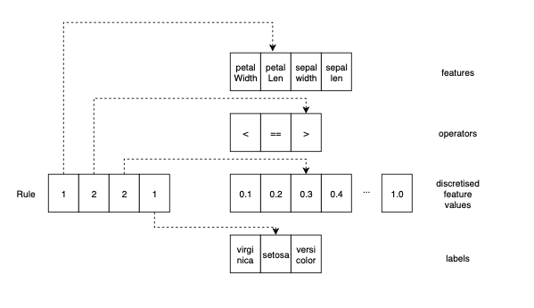

# Rule Induction Algorithms

## Principles

### Rule Representation
In Topic One we looked at 'Knowledge-Based systems'  
where **humans provided the rules** for a situation.



In supervised learning we are interested in how we can make   
**machines learn the rules** for an application.   
- e.g. **if** feature_n > threshold **then** prediction.

To do that we need to have:
1. A representation for rules  
2. A way of assigning "goodness" to (sets of) rules.
3. A way of algorithmically generating possible rules  
   We have fixed sets of features,operators,outputs,  
   We can **discretize** the thresholds for each feature    
   So we can use nested loops to create all possible rules.

### Rule Matching
We say that a rule *covers* a training example (features, label) if
- the example features meet the rule's _condition_
- the rule's _action_ (prediction) matches the example's label.

### Decision Boundaries and Default Classes
Most existing algorithms tend to use  rules built up of lots of axis-perpendicular decisions.   
-  For example the (useless) rule  *If( petal_length > 0.3) THEN ("Setosa")*   
  Draws a line through feature space, at right angles to the petal_length axis, crossing it at 0.3.  
  Puts the label "setosa" on one side, nothing on the other

- As more rules are added, the model effectively builds labelled (hyper) boxes in space.  
  
- Rest of 'decision space' is given with the default (majority) label

   
## Greedy rule induction: keep choosing the next best rule

We can exploit the ability to generate rules algorithmically to make a simple Machine Learning algorithm that **automatically** learns rules, using a greedy constructive hill climbing approach:  

This is a **generate-and-test** approaich for search the space of all possible models, that repeatedly takes the "next-best" rule to create a rule-set.     
- Note that this method can be easily out-perfomed by more sophisticted approaches.
We start by making a copy of the training set: call this the _NotCovered_ data.  
Then in a loop until the NotCovered data is empty, or we cannot add any rules that don't make errors:
1. __Generate__ all the possible rules as described above
2. __Test__ how how many examples from  the _NotCovered_ data each rule covers
3. __Select__  the one that  covers the most un-covered examples **without making any wrong predictions**
   - add the new rule to our model
   - remove the examples that rule covered from the set of _NotCovered_ data


  
  
## Pseudocode
While it is being trained, the model holds:
- _ruleset_: a set of rules (initially empty)
- _NotCovered_ : a set of training examples
- a default class

**Note that a set of rules may not cover every training example**
 - because it may not be possible without making wrong predictions
 - or we may choose to limit the number of rules for simplicity or explainability
 
 
### Main Model-Fitting (training) loop - equivalent to fit()
 ```
function GreedyRuleInduction:  
    #step 0.
    Preprocess (trainingset)  
    SET model.ruleSet = empty ruleset
    SET notCovered = Copy(trainingset)
    SET default_prediction= GetMajorityClass(notCovered)

    #Main loop
    SET Improved=TRUE
    WHILE ( Size(notCovered)>0  AND Size(model.ruleSet< MaxRules  AND Improved) DO  
        # set up
        SET Improved= FALSE
        SET bestNewRule = [] # empty rule
        SET coveredByBest = [] empty set
        
        #loop to test new rule
        FOR newRule in  (all_possible_rules)  # 4 nested for-loops
            covered = GetExamplesCoveredBy(newRule, notCovered)
            IF ( SIZE(covered) > SIZE(coveredByBest) ) THEN
                SET coveredByBest= covered
                SET bestNewRule = newRule
                SET Improved=TRUE
                
        #add best rule if found
        IF (Improved) THEN
            SET notCovered = notCovered / coveredByBest.  #set exclusion operation
            SET model.ruleSet = model.ruleSet + bestNewRule
    RETURN ruleset
```
### Supporting Functions
```
function GetExamplesCoveredBy(newRule, notCovered):
    # assumes a rule is a tuple of [ feature,operator, threshold,prediction]
    # and that an example is a tuple of [featureValues, label]
    SET errors = FALSE
    SET covered = emptyset
    
    FOR (example in notCovered) DO
       IF MeetsConditions(example, rule) THEN
          IF example.label EQUALS rule.prediction THEN
              SET covered = covered + example
          ELSE
            SET errors = TRUE
            BREAK
            
    IF (errors EQUALS TRUE)
       return emptyset
       
    ELSE
       return covered
       
```
    
### test whether a rule applies to an example 
```
function MeetsConditions(example, rule)
   SET matches=FALSE
   SET feature= rule.feature
   SET operator = rule.operator
   SET threshold= rule.threshold
   
   set exampleValue= example.featureValues[feature]
   IF (operator IS Equals) THEN
      IF (exampleValue EQUALS threshold) THEN
           SET matches = TRUE
   ELSEIF (operator IS LessThan) THEN
      IF (exampleValue < threshold) THEN
          SET matches = TRUE
   ELSEIF (operator IS MoreThan) THEN
      IF  (exampleValue > threshold) THEN
           SET matches = TRUE

   #could extend to <= etc
  
   RETURN matches
```


### apply learned ruleset to make prediction
```
function makePrediction(example,ruleset)
    SET prediction= default_prediction
    
    FOR (rule in model.ruleSet) DO
        IF MeetsConditions( example,rule) THEN
           SET prediction= rule.prediction
           BREAK
    return prediction
```

# Flow charts
## Model learning


## Predicting with model

